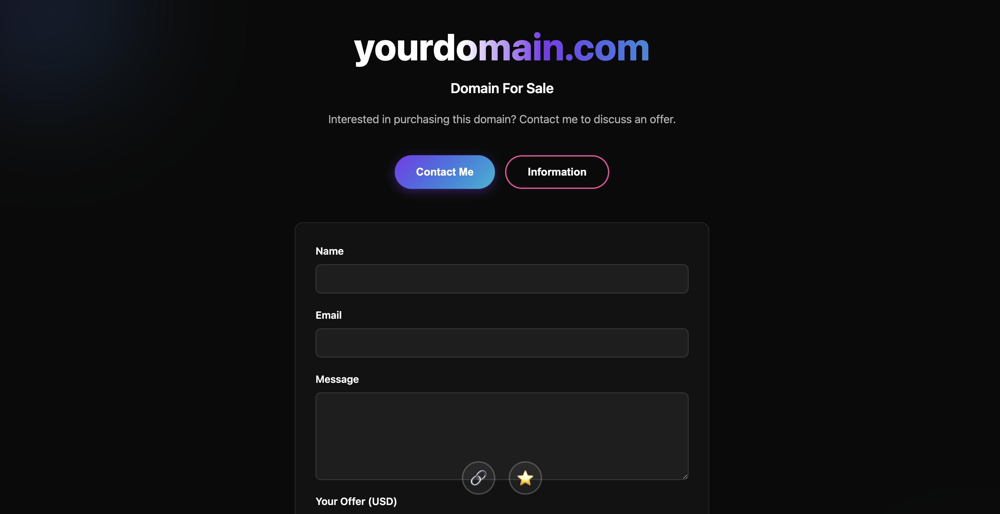
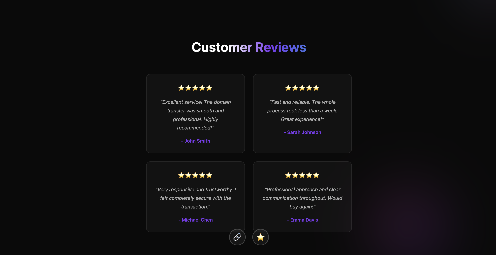

# Domain For Sale Landing Page

A modern, sleek domain selling landing page built with HTML, CSS, and JavaScript. Features a stunning gradient design, customer reviews, and an integrated contact form with price offers.

## Screenshots

### Hero Section


### Contact Form & Reviews


## Configuration Guide

### 1. Change the Domain Name

**File:** `index.html`

Find and replace the domain name in the hero section:

```html
<!-- BEFORE -->
<h1 class="title-gradient"><span class="domain-name">yourdomain.com</span></h1>

<!-- AFTER -->
<h1 class="title-gradient"><span class="domain-name">yourdomainname.com</span></h1>
```

### 2. Update the Owner Website Link

**File:** `index.html`

Change the website link that appears when clicking the chain icon (🔗):

```html
<!-- BEFORE -->
<a href="https://andreatasselli.it" target="_blank" class="social-icon" title="Website">🔗</a>

<!-- AFTER -->
<a href="https://yourwebsite.com" target="_blank" class="social-icon" title="Website">🔗</a>
```

### 3. Add Email Notifications (EmailJS Setup)

**File:** `index.html`

Add EmailJS library before closing `</body>` tag:

```html
<script type="text/javascript" src="https://cdn.jsdelivr.net/npm/@emailjs/browser@3/dist/index.min.js"></script>
<script>
    emailjs.init('YOUR_PUBLIC_KEY_HERE');
</script>
```

**To get your keys:**
1. Go to [emailjs.com](https://emailjs.com)
2. Sign up for a free account
3. Create an email service (Gmail, Outlook, etc.)
4. Create an email template
5. Copy your **Public Key** and **Service ID**

### 4. Configure Email Sending in JavaScript

**File:** `js/main.js`

Replace the `submitForm()` function to send emails:

```javascript
function submitForm(formData) {
    // Disable submit button
    const submitBtn = document.querySelector('button[type="submit"]');
    const originalText = submitBtn.textContent;
    submitBtn.disabled = true;
    submitBtn.textContent = 'Sending...';

    // Send email via EmailJS
    emailjs.send('YOUR_SERVICE_ID', 'YOUR_TEMPLATE_ID', {
        from_name: formData.name,
        from_email: formData.email,
        message: formData.message,
        price: formData.price,
        to_email: 'your-email@example.com'  // Where you'll receive offers
    }).then(function(response) {
        console.log('Success:', response);
        showSuccessMessage(submitBtn, originalText);
    }, function(error) {
        console.log('Failed:', error);
        alert('Error sending message. Please try again.');
        submitBtn.disabled = false;
        submitBtn.textContent = originalText;
    });
}

function showSuccessMessage(submitBtn, originalText) {
    const form = document.getElementById('contactForm');
    const successMessage = document.getElementById('successMessage');
    
    form.style.display = 'none';
    successMessage.style.display = 'block';

    setTimeout(() => {
        submitBtn.disabled = false;
        submitBtn.textContent = originalText;
    }, 3000);
}
```

### 5. Customize Customer Reviews

**File:** `index.html`

Update the reviews section with real customer testimonials:

```html
<div class="review-card">
    <div class="review-stars">⭐⭐⭐⭐⭐</div>
    <p class="review-text">"Your review text here. Describe your experience with the domain purchase."</p>
    <p class="review-author">- Customer Name</p>
</div>
```

Add or remove review cards as needed.

### 6. Update Transfer Information

**File:** `index.html`

Edit the domain transfer timeline and process in the Information modal:

```html
<h3>Domain Transfer Process</h3>
<p>Once we agree on a price and terms, the domain transfer process will follow these steps:</p>
<ul>
    <li><strong>Step 1 - Agreement:</strong> Your custom terms here</li>
    <li><strong>Step 2 - Payment:</strong> Your payment methods here</li>
    <!-- Add more steps -->
</ul>
```

### 7. Customize Colors (Optional)

**File:** `css/style.css`

Modify the CSS variables at the top:

```css
:root {
    --primary-color: #1a1a1a;
    --secondary-color: #ffffff;
    --accent-color: #7c3aed;        /* Purple */
    --accent-color-2: #06b6d4;      /* Cyan */
    --accent-color-3: #ec4899;      /* Pink */
    --text-color: #ffffff;
    --text-muted: #b0b0b0;
    --border-color: #333333;
    --shadow: 0 2px 8px rgba(0, 0, 0, 0.3);
}
```

## File Structure

```
DomainSale/
├── index.html          # Main HTML file - Edit domain name, links, reviews
├── css/
│   └── style.css       # Styling - Edit colors here if needed
├── js/
│   └── main.js         # JavaScript - Edit to add email functionality
└── README.md           # This file
```

## Minimum Offer Validation

The form requires a minimum offer of **$20 USD**. Edit this in `js/main.js`:

```javascript
if (!price || price < 20) {  // Change 20 to your minimum offer
    alert('Please enter an offer of at least $20');
    return false;
}
```

## Contact Form Fields

The form collects:
- **Name** (required)
- **Email** (required, validated)
- **Message** (required)
- **Price Offer** (required, minimum $20)
- **Terms Agreement** (required checkbox)

## Browser Support

- Chrome (latest)
- Firefox (latest)
- Safari (latest)
- Edge (latest)
- Mobile browsers

## License

This project is open source and available under the MIT License.

## Support

For issues or questions about implementation:
1. Check the configuration sections above
2. Verify all variables are correctly set
3. Test in different browsers
4. Check browser console for errors (F12)

## Customization Checklist

- [ ] Update domain name in hero section
- [ ] Update owner website link
- [ ] Setup EmailJS account and get API keys
- [ ] Configure email sending in JavaScript
- [ ] Add real customer reviews
- [ ] Update transfer process details
- [ ] Customize colors if desired
- [ ] Test contact form with email sending
- [ ] Deploy to your hosting
- [ ] Test on mobile devices

## Version History

- **v1.0** - Initial release with full features
  - Domain sales page
  - Contact form with price offers
  - Customer reviews section
  - Transfer information modal
  - EmailJS integration ready

---

**Made with ❤️ for domain sellers**
